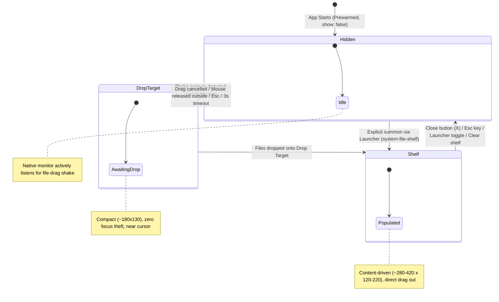

# SuperCmd File Shelf Interaction Specification & State Machine

## 1. State Machine Overview

The File Shelf interaction model operates across three principal states: **Hidden**, **DropTarget**, and **Shelf**.

---

## 2. Formal State Definitions

### State 1: `Hidden`
- **Window State**: Window is created and prewarmed in memory (`show: false`). Renderer is already loaded, styled, and responsive.
- **Background Processes**:
  - Native gesture monitor (`file-shelf-gesture-monitor`) is running.
  - Monitors `leftMouseDragged` and `leftMouseUp`.
- **Screen Footprint**: 0 pixels. Completely invisible and consumes minimal CPU.

### State 2: `DropTarget`
- **Window State**: Visible, frameless, translucent / vibrant dark-light styling.
- **Window Properties**:
  - `showInactive()` is called so the window **never steals focus** from Finder or active applications.
  - `alwaysOnTop: true` with `'floating'` level so it floats above standard windows.
  - `acceptFirstMouse: true` allowing immediate mouse response.
- **Geometry**: Compact rounded box ($\approx 180 \times 130\text{px}$), positioned offset from the mouse cursor (centered or slightly below cursor $+15\text{px}$).
- **Visual Content**:
  - Glowing drop receptacle with subtle border pulsation.
  - Minimal label: "Drop files here" / "放入文件".
  - No title bar, no toolbar buttons, no close button required (will auto-dismiss if not dropped).
- **Event Handling**:
  - `dragenter` / `dragover`: Displays active highlight.
  - `drop`: Ingests files and immediately morphs to `Shelf`.
  - `leftMouseUp` without drop: Dismisses back to `Hidden` after a 200ms grace window.

### State 3: `Shelf`
- **Window State**: Active compact staging panel.
- **Geometry**: Content-driven compact sizing ($\approx 280\text{--}420\text{px}$ wide, $120\text{--}220\text{px}$ high).
  - 1 file: Minimal card ($\approx 280 \times 90\text{px}$).
  - 2–4 files: Compact 2-column or row grid ($\approx 360 \times 140\text{px}$).
  - 5+ files: Compact scrollable grid with badge count ($\approx 400 \times 200\text{px}$).
- **Window Behavior**:
  - Can be repositioned by dragging header / blank area.
  - Remains visible on blur (`blur` does not hide the window).
  - Can accept subsequent drops (appending new files).
- **Item Interactions**:
  - **Click**: Selects single item.
  - **⌘ + Click**: Multi-selects items.
  - **Drag Item**: Triggers `event.sender.startDrag` with `NSDragOperationCopy`. If the dragged item is part of the multi-selection, drags **all selected files**.
- **Secondary Actions via Progressive Disclosure**:
  - **Item Context Menu**: Show in Finder, Copy File Reference (`⌘C`), Remove from Shelf (`Delete`).
  - **Background Context Menu**: Clear Shelf, Always on Top, Shake to Activate, Hide Shelf.
  - **Close Button**: Subtle `×` button in corner to dismiss.

---

## 3. State Transitions & Trigger Matrix

| Transition | Trigger Event | Action / System Response |
| :--- | :--- | :--- |
| **Hidden → DropTarget** | Native Shake detected during file drag | Calculate position near cursor clamped to current display workArea; `window.showInactive()`; set mode to `'target'`. |
| **DropTarget → Shelf** | Files dropped into Drop Target | Add paths to `FileShelfStore`; transition mode to `'shelf'`; resize bounds to compact shelf dimensions; update snapshot. |
| **DropTarget → Hidden** | Left mouse released outside target | Native monitor emits `mouse_up`; if no drop registered within 200ms, window hides. |
| **DropTarget → Hidden** | User presses `Esc` | Window hides immediately; mode reset to `'hidden'`. |
| **Hidden → Shelf** | Launcher command `system-file-shelf` | Position at last saved coordinates (or cursor display); `window.show()`; window gains focus. |
| **Shelf → Hidden** | User clicks close `×` or presses `Esc` | Window hides; position saved to store. |
| **Shelf → Hidden** | Launcher toggle command executed | Window hides. |
| **Shelf → Shelf** | User drops additional files | Paths appended to existing shelf entries; deduplicated; UI updates reactively. |

---

## 4. Detailed Behavior Specifications

### 4.1 Shake Trigger Mechanics
- **Active Drag Verification**: The native monitor checks that `leftMouseDragged` is active AND `NSPasteboard(name: .drag)` contains `public.file-url` or `NSFilenamesPboardType`. Text drags or non-file drags are ignored.
- **Sliding Window Analysis**:
  - Samples mouse positions over a 500ms sliding buffer.
  - Reversals: Horizontal movement direction reverses $\ge 3$ times.
  - Segment Distance: Each reversal segment must span $\ge 25\text{px}$.
  - Net Displacement: Total distance traveled must be $\ge 120\text{px}$, but net vector distance between start and end must be $\le 150\text{px}$ (preventing straight-line swipes across screen).
- **Cooldown**: Following a trigger, a 1200ms cooldown is enforced so the target is not repeatedly summoned during the same drag stroke.

### 4.2 Multi-Display & Boundary Clamping
- When the gesture occurs, the cursor's global coordinates $(cx, cy)$ are queried via `screen.getCursorScreenPoint()`.
- The active display is resolved via `screen.getDisplayNearestPoint({ x: cx, y: cy })`.
- Target bounds are clamped strictly within `display.workArea`:
  $$x = \max(\text{workArea.x}, \min(cx - \text{width}/2, \text{workArea.x} + \text{workArea.width} - \text{width}))$$
  $$y = \max(\text{workArea.y}, \min(cy + 15, \text{workArea.y} + \text{workArea.height} - \text{height}))$$
- This guarantees full visibility across displays positioned to the left (negative $x$), above (negative $y$), and across varying Retina scaling factors.

### 4.3 App Restart & Persistence
- **On App Startup**:
  - `shelf.json` is read and validated.
  - File references and `alwaysOnTop` settings are restored into memory.
  - **Window remains hidden**: SuperCmd will never spontaneously pop open a window on user desktop during startup.
  - Previous window coordinates are remembered and clamped against active screens when summoned.

### 4.4 Unavailable & Missing File Handling
- When source files are moved or deleted externally in Finder:
  - The shelf entry remains listed (so user knows what was there).
  - Status is marked `available: false` with reason `missing`.
  - Icon is dimmed; unavailable badge is shown.
  - Dragging or copying unavailable items is rejected with a user-friendly notification.
  - Right-click "Remove from Shelf" allows removing dead references.
